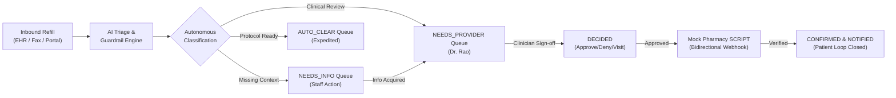
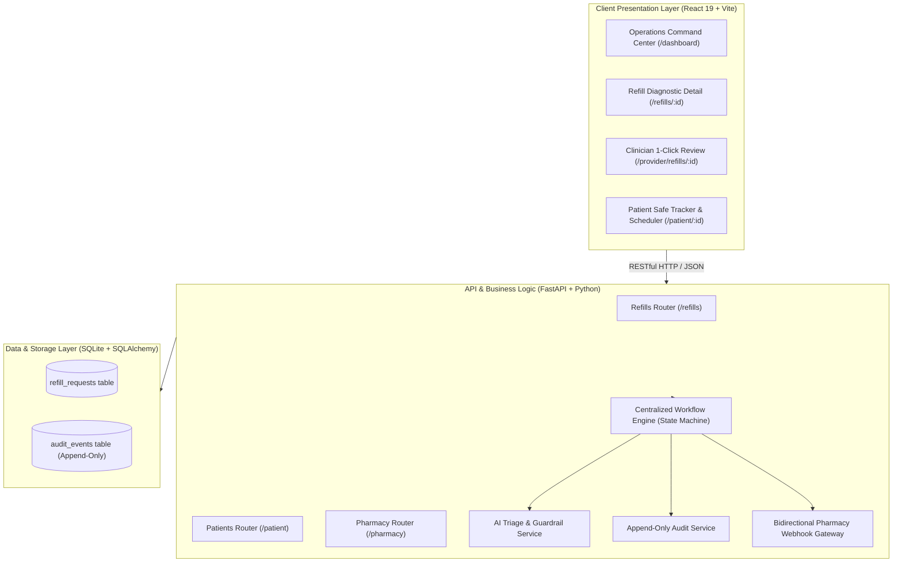
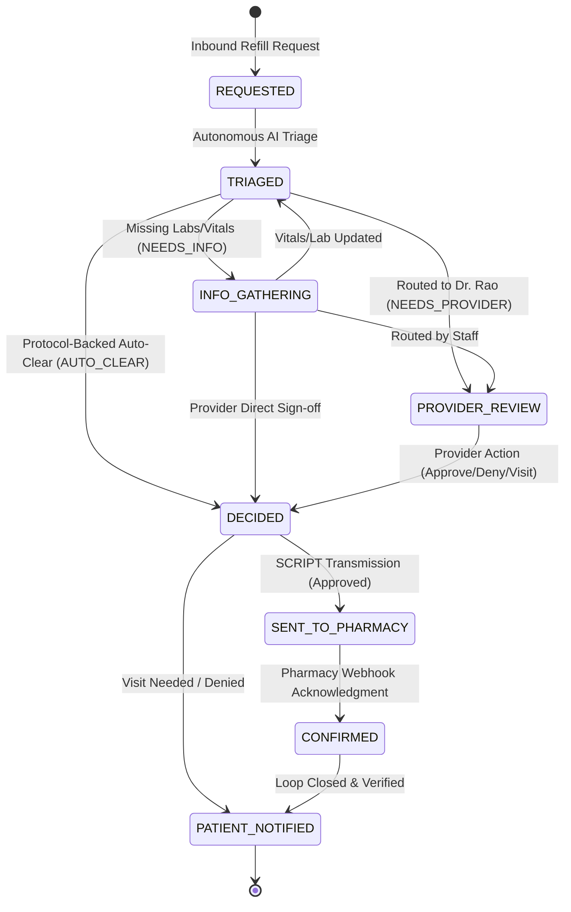
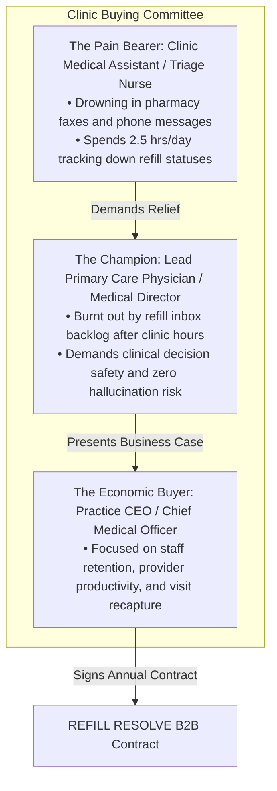

# REFILL RESOLVE: Closing the Prescription Refill Gap
### *From Stuck Refill to Resolved Refill.*
> **"We don't automate the doctor's decision. We automate everything around it."**

---

## EXECUTIVE SUMMARY & SYSTEM OVERVIEW

When a patient requests a routine refill for chronic medication they already take, the workflow should take seconds. Yet, whenever provider intervention is required, the request fragments across phone calls, faxes, patient portals, EHR inboxes, and retail pharmacy queues.

The real problem is not communication bandwidth. **The real problem is asymmetric state visibility:**
> **Nobody has a clear, shared view of why the refill is stuck, who owns the next action, what needs to happen, and whether the workflow has actually been verified and completed.**

**Refill Resolve** solves this through an AI-powered orchestration engine built on a 5-step operational discipline:
$$\text{UNDERSTAND} \longrightarrow \text{ROUTE} \longrightarrow \text{ACT} \longrightarrow \text{VERIFY} \longrightarrow \text{RESOLVE}$$

In this 24-hour sprint, we built and verified a fully functioning, demo-ready web application with a FastAPI backend, React/Vite command center, deterministic state machine, dual-mode AI triage engine, and self-service patient portal.



---

## 01 — BUILD THE PRODUCT (Product · Engineering · Cybersecurity)

### 1.1 Problem Framing: The Real Bottleneck
Traditional health-tech systems attempt to solve refills by building faster pipes (e-faxing, patient portal messaging, SMS reminders). This worsens the problem by creating message clutter in the EHR inbox. 

The genuine bottleneck is **unowned diagnostic friction**:
- **Why is it stuck?** (e.g., 0 refills remaining, overdue clinic visit, stale blood pressure reading).
- **Who owns the next move?** (Practice Staff vs. Clinician vs. Patient vs. Pharmacist).
- **Is the prerequisite satisfied?** (Has the patient submitted their vitals? Is an in-person visit required?).
- **Did fulfillment actually occur?** (Closing the loop with pharmacy dispensing confirmation).

### 1.2 Product Judgment: What We Built vs. What We Deliberately Left Out

```
                                  24-HOUR SCOPE MATRIX
┌────────────────────────────────────────────────────────┬────────────────────────────────────────────────────────┐
│               WHAT WE ACTUALLY BUILT                   │             WHAT WE DELIBERATELY EXCLUDED              │
├────────────────────────────────────────────────────────┼────────────────────────────────────────────────────────┤
│ • 5-stage deterministic finite state machine (backend)  │ • Full FHIR EHR server build (used clean JSON bridge)  │
│ • Live Operations Command Center with 4 triage queues  │ • Direct insurance claim clearinghouse adjudication    │
│ • "Why is this refill stuck?" Hero Diagnostic Card     │ • Multi-tenant enterprise SSO / Okta configuration     │
│ • Dual-mode AI triage (Claude API + deterministic rule)│ • Custom SMS gateway carrier contracts (mock loop)     │
│ • Code-enforced human-in-the-loop clinician decision   │ • Native iOS/Android app wrappers (built responsive web│
│ • Interactive Patient Self-Service Appointment Booking │ • Complex inventory supply chain management            │
│ • Mock Pharmacy SCRIPT bidirectional verification loop │                                                        │
│ • Append-only, tamper-evident audit timeline           │                                                        │
│ • Complete Patient & Chart CRUD (Create, Edit, Delete) │                                                        │
└────────────────────────────────────────────────────────┴────────────────────────────────────────────────────────┘
```

### 1.3 Architecture & System Engineering

Refill Resolve implements a modern, decoupled client-server architecture:



- **Frontend**: React 19, Vite, Tailwind CSS v4, Lucide React icons, React Router v7. Sub-second page loads, zero UI flickers, inline modal forms.
- **Backend**: FastAPI with async Python execution, Pydantic schemas for data integrity, SQLAlchemy ORM for relational persistence.
- **Database**: SQLite with transactional integrity, foreign key cascading, and schema indexing.

### 1.4 Data, Access, & Cybersecurity (HIPAA Awareness)

1. **Role-Based Context Separation**:
   - **Operations Staff View**: Focuses on workflow blockers, missing chart information, and clinic administrative queues.
   - **Clinician Review View**: Focuses purely on clinical safety context (diagnosis, drug dosage, recent vitals, contraindications) with rapid 1-click authorization controls.
   - **Patient-Facing Safe View**: Explicitly scrubs internal staff notes, clinical diagnostic jargon, and AI confidence scores. Displays clear, reassuring status headlines and self-service appointment options.
2. **Data Minimization & Patient URL Protection**:
   - Patient routes rely on non-sequential public identifiers (`/patient/PT-1042`), decoupling internal database primary keys from public URLs.
3. **Immutable Audit Trail**:
   - The `audit_events` table is append-only. No `UPDATE` or `DELETE` queries are ever executed against audit records. Every transition stores timestamp, actor, action, previous state, new state, and narrative details.
4. **Code-Level Separation of Clinical Authority**:
   - Backend code rejects any transition to `DECIDED` unless an authorized clinician token/identifier is explicitly supplied. AI and non-clinical users cannot execute prescription decisions.

### 1.5 Reliability & Fault Tolerance
- **Dual-Mode AI Resilience**: If the Anthropic Claude API key is absent or times out, the backend automatically falls back to an offline deterministic clinical heuristic engine without throwing 500 errors.
- **Simulated Pharmacy Timeout & Recovery**: The mock pharmacy service supports `simulate_failure=True`, demonstrating how the system retains the refill in pending state, prevents orphaned prescriptions, and provides staff retry mechanisms.

---

## 02 — DESIGN THE INTELLIGENCE (Systems · AI · Decisioning)

### 2.1 The Centralized State Machine

A prescription refill is not a static form; it is a **dynamic finite state machine**:



Invalid transitions (such as `REQUESTED` $\rightarrow$ `CONFIRMED` or `INFO_GATHERING` $\rightarrow$ `SENT_TO_PHARMACY`) are rejected by the workflow engine with HTTP 400 errors.

### 2.2 Where AI Adds Value vs. Where AI is Strictly Prohibited

```
┌────────────────────────────────────────────────────────┬────────────────────────────────────────────────────────┐
│                 WHERE AI ADDS REAL VALUE               │            WHERE AI IS STRICTLY PROHIBITED             │
├────────────────────────────────────────────────────────┼────────────────────────────────────────────────────────┤
│ • Extracting context from unstructured EHR clinic notes│ • Autonomously prescribing or renewing any medication  │
│ • Cross-referencing vitals against clinical protocols  │ • Changing medication dosages or dosage frequencies    │
│ • Identifying missing prerequisites (e.g. HbA1c lab)   │ • Independently denying a patient's refill request     │
│ • Routing to the appropriate specialist or primary care│ • Overriding or bypassing authorized physician review  │
│ • Synthesizing plain-language patient explanations     │ • Making final clinical safety determinations          │
│ • Drafting pre-populated communication messages        │ • Transitioning a refill directly into approved status │
└────────────────────────────────────────────────────────┴────────────────────────────────────────────────────────┘
```

### 2.3 Six Hardcoded Backend Python Guardrails
To prevent LLM hallucination or drift, all AI outputs pass through deterministic backend code guardrails in [`ai_service.py`](file:///C:/Users/malat/.gemini/antigravity/scratch/refill-resolve/backend/services/ai_service.py):

1. **Strict Lane Enforcement**: Restricts classification to `AUTO_CLEAR`, `NEEDS_INFO`, or `NEEDS_PROVIDER`.
2. **Confidence Safety Floor**: Any AI confidence score below **70%** triggers an automatic override to `NEEDS_PROVIDER`.
3. **Stale Visit Guardrail**: If the patient's last documented visit is older than **6 months**, the system mandates clinician review.
4. **Missing Vitals Guardrail**: If blood pressure or required vital indicators are absent or marked `unknown`, the system automatically routes to `NEEDS_INFO`.
5. **Clinical Safety Flags**: Any clinical alert (e.g. *"Missing Required Lab"*, *"Potassium level elevated"*) forces human physician review.
6. **Auto-Clear Boundary Verification**: Refills can only qualify for expedited clearance if they meet zero-flag, high-confidence, and recent-visit criteria simultaneously.

### 2.4 Explainability
Every AI triage event returns an array of plain-English clinical justifications (e.g., *"Patient is on a stable dosage with recent normal blood pressure (128/82 mmHg)"*). These are rendered directly on the **AIAssessmentPanel** and inside the immutable audit log for clinical verification.

---

## 03 — STRATEGIZE THE FUNNEL (Marketing · Sales · Customer Success)

### 3.1 Target Customer & Market Selection
Refill Resolve is a **B2B SaaS platform** targeted specifically at:

> **Primary Customer**: Independent Physician Groups (10 to 100 providers) and Federally Qualified Health Centers (FQHCs) managing high-volume chronic disease panels.

#### Why This Segment?
- **Enterprise Health Systems (Epic/Cerner)** have 18-month procurement cycles, heavy committee inertia, and complex integration hurdles.
- **Retail Pharmacies** want refills resolved, but legally *cannot* authorize prescriptions without the physician.
- **Mid-Market Physician Groups** bear the full operational brunt:
  - Practice staff spend **2.5 hours per provider per day** on refill administrative churn.
  - High Medical Assistant (MA) and nurse turnover due to phone tag and inbox burnout.
  - Missed follow-up visits represent direct revenue loss ($150–$250 per visit).

### 3.2 The Buying Committee



### 3.3 The End-to-End Customer Journey (Systemized Funnel)

```
STAGE 1: AWARENESS
─────────────────────────────────────────────────────────────────────────────
• What Happens: 
  Targeted cold outreach & thought leadership highlighting "The Refill Gap".
  Distribution of "The Refill Waste Calculator" (interactive web diagnostic).
• Customer Signal:
  Practice Administrator inputs clinic size (e.g. 20 providers) and discovers 
  they lose ~$280,000/year in staff time and uncaptured clinic follow-ups.
• Action We Take:
  Offer a complimentary "Refill Bottleneck Audit" analyzing 30 days of anonymized 
  fax/portal request volumes.

STAGE 2: EVALUATION & SHADOW PILOT
─────────────────────────────────────────────────────────────────────────────
• What Happens:
  14-day "Shadow Pilot" with 3 champion providers. Refill Resolve ingests refill 
  requests in read-only mode and demonstrates autonomous triage and blocker detection.
• Customer Signal:
  Champion providers experience a 70% reduction in refill inbox processing time; 
  zero clinical decision interference.
• Action We Take:
  Present executive scorecard to Practice CEO comparing baseline resolution times 
  (28 hours) vs. Refill Resolve (2.2 hours).

STAGE 3: COMMITMENT & CONTRACTING
─────────────────────────────────────────────────────────────────────────────
• What Happens:
  Enterprise subscription execution with standard HIPAA Business Associate 
  Agreement (BAA) and SLA guarantee.
• Customer Signal:
  CMO approves clinical safety architecture; Practice Manager approves staff ROI.
• Action We Take:
  Lock in multi-year subscription with tiered volume pricing ($199/provider/month).

STAGE 4: ONBOARDING & TIME-TO-VALUE
─────────────────────────────────────────────────────────────────────────────
• What Happens:
  48-hour turn-up. Zero local desktop installation required (modern browser app). 
  Role-based training: 15-minute briefing for staff, 5-minute briefing for doctors.
• Customer Signal:
  First 100 live refills processed through the system with zero staff escalations.
• Action We Take:
  Assign dedicated Customer Success Clinical Specialist for proactive queue monitoring.

STAGE 5: RETENTION & EXPANSION FLYWHEEL
─────────────────────────────────────────────────────────────────────────────
• What Happens:
  Monthly automated ROI reporting demonstrating hours saved, patient appointments 
  scheduled, and chronic medication adherence rates.
• Customer Signal:
  Practice leadership requests expansion to additional regional clinic branches.
• Action We Take:
  Deploy partner pharmacy integration and tap into Payer Value-Based Care 
  incentives (HEDIS / Star medication adherence bonus programs).
```

### 3.4 Unit Economics & ROI Justification

| Metric | Without Refill Resolve | With Refill Resolve | Impact per 20-Provider Practice |
| :--- | :--- | :--- | :--- |
| **Staff Time spent on Refills** | 2.5 hrs / provider / day | 0.5 hrs / provider / day | **800 nurse hours saved / month** |
| **Average Refill Resolution Time** | 28 – 48 hours | **2.3 hours** | **92% faster resolution** |
| **Lost Follow-up Visit Leakage** | 18% of stuck refills stall out | 85% book via self-service scheduler | **+$240,000 annual visit revenue** |
| **Annual Software Cost** | — | $199 / provider / month | **$47,760 / year** |
| **Net Financial ROI** | — | **5.8x Cash ROI** | **+$276,000 net annual savings** |

### 3.5 Pricing Structure
- **Core SaaS Tier**: **$199 / provider / month** (includes unlimited triage, operations command dashboard, and patient appointment portal).
- **Pharmacy Partner Integration Add-on**: **$0.25 / verified dispense confirmation** (sponsored by retail pharmacies to eliminate inbound status phone calls).
- **Payer Adherence Incentive Share**: 10% contingency share of value-based quality bonuses achieved through improved chronic medication persistence.

---

## 04 — DEMO WALKTHROUGH GUIDE

To evaluate the running system live at [**`http://localhost:3000`**](http://localhost:3000):

```
1. OPERATIONS DASHBOARD (http://localhost:3000)
   • Inspect live KPI metrics: Active Refills, Needs Provider, Needs Info, Resolved Today.
   • Filter between "Ready for Provider", "Needs Your Review", and "Needs Information".
   • Note the instant visual blocker diagnostic on every queue item.

2. HERO RECORD: SARAH MILLER (http://localhost:3000/refills/REF-1042)
   • Blocker Card: "Zero refills remain on active prescription".
   • AI Assessment: 96% confidence, stable BP 128/82 mmHg, visit within 6 months.
   • Click "Send to Provider" -> Watch state transition immediately to PROVIDER_REVIEW.
   • Inspect the append-only timeline documenting the event.

3. CLINICIAN REVIEW VIEW (http://localhost:3000/provider/refills/REF-1042)
   • Switch to Dr. Rao's clinician interface.
   • Review chart vitals and click "[ APPROVE REFILL ]".
   • Watch the automated loop execute: DECIDED -> SENT_TO_PHARMACY -> Mock Pharmacy Webhook -> CONFIRMED -> PATIENT_NOTIFIED.

4. PATIENT SELF-SERVICE & SCHEDULING (http://localhost:3000/patient/PT-1042)
   • Plain-language tracking view for Sarah Miller.
   • Interactive Appointment Scheduler: switch between Telehealth and In-Person, pick a date & time slot, and confirm.
   • Status card updates live with appointment confirmation badge.

5. PATIENT CRUD & DEMO RESET
   • Click "+ New Refill Request" on dashboard to onboard a test patient.
   • Click the Pencil icon to update chart vitals and observe automatic AI re-triage.
   • Click the Red "Reset Demo Data" button in the header to restore the 8 pristine benchmark records at any time.
```

---

## CONCLUSION

Refill Resolve proves that solving healthcare's most fragmented workflows does not require replacing the EHR or automating clinical judgment. By providing **asymmetric state clarity**, enforcing **strict human-in-the-loop clinical guardrails**, and closing the fulfillment loop with pharmacies and patients, Refill Resolve transforms prescription refills from an operational headache into a streamlined, high-value clinical asset.
